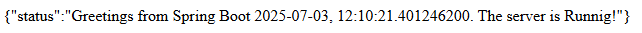
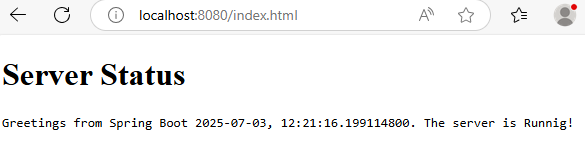

# Spring.io, Websockets y ReactJs

## Author: David Alfonso Barbosa Gómez

1. After creating the basic structure of the project, it is necessary to update the pom.xml file with the following dependencies.
  ```
  <dependencies>
   <dependency>
     <groupId>org.springframework.boot</groupId>
     <artifactId>spring-boot-starter-web</artifactId>
     <version>2.3.1.RELEASE</version>
   </dependency>
  </dependencies>
  ```
2. Create the main Spring Boot application class.
  ```
  package co.edu.escuelaing.websocketsprimer;
  import org.springframework.boot.SpringApplication;
  import org.springframework.boot.autoconfigure.SpringBootApplication;
  @SpringBootApplication
  public class WSStartApp {
   
   public static void main(String[] args){
   SpringApplication.run(WSStartApp.class, args);
   }
  }
  ```
3. Create a web controller that loads the minimum Web MVC settings.
  ```
    package co.edu.escuelaing.websocketsprimer;
    import org.springframework.web.bind.annotation.GetMapping;
    import org.springframework.web.bind.annotation.RestController;
    @RestController
    public class WebController {
     
     @GetMapping("/status")
     public String status() {
     return "{\"status\":\"Greetings from Spring Boot "
     + java.time.LocalDate.now() + ", "
     + java.time.LocalTime.now()
     + ". " + "The server is Runnig!\"}";
     }
    }
  ```
4. Create an html index in this location: **/src/main/resources/static**

5. Run the class we just created, and the server should start executing.
6. Verify the execution accessing to: **localhost:8080/status**

    
7. Verify if the server is delivering the web statics in: **localhost:8080/index.html**

   

## Making the server EndPoint with Websockets

```
package com.eci.ARSW.WebSockets.Hora;

import jakarta.websocket.server.ServerEndpoint;
import org.springframework.stereotype.Component;

import java.io.IOException;
import java.util.logging.Level;
import java.util.Queue;
import java.util.concurrent.ConcurrentLinkedQueue;
import java.util.logging.Logger;
import jakarta.websocket.OnClose;
import jakarta.websocket.OnError;
import jakarta.websocket.OnOpen;
import jakarta.websocket.Session;
import jakarta.websocket.server.ServerEndpoint;

@ServerEndpoint(value = "/timer")
@Component
public class TimerEndpoint {
    private static final Logger logger = Logger.getLogger("ETFEndpoint");
    static Queue<Session> queue = new ConcurrentLinkedQueue<>();
    public static void send(String msg) {
        try {
            for (Session session : queue) {
                session.getBasicRemote().sendText(msg);
                logger.log(Level.INFO, "Sent: {0}", msg);
            }
        } catch (IOException e) {
            logger.log(Level.INFO, e.toString());
        }
    }
    @OnOpen
    public void openConnection(Session session) {
        queue.add(session);
        logger.log(Level.INFO, "Connection opened.");
        try {
            session.getBasicRemote().sendText("Connection established.");
        } catch (IOException ex) {
            Logger.getLogger(TimerEndpoint.class.getName()).log(Level.SEVERE, null, ex);
        }
    }
    @OnClose
    public void closedConnection(Session session) {
        queue.remove(session);
        logger.log(Level.INFO, "Connection closed.");
    }
    @OnError
    public void error(Session session, Throwable t) {
        queue.remove(session);
        logger.log(Level.INFO, t.toString());
        logger.log(Level.INFO, "Connection error.");
    }
}
```

### class that emits messages from the server

```
package com.eci.ARSW.WebSockets.Hora;

import java.text.SimpleDateFormat;
import java.util.Date;
import java.util.logging.Level;
import java.util.logging.Logger;
import org.springframework.context.annotation.Scope;
import org.springframework.scheduling.annotation.Scheduled;
import org.springframework.stereotype.Component;
@Component
@Scope("singleton")
public class TimedMessageBroker {

    private static final SimpleDateFormat dateFormat = new
            SimpleDateFormat("HH:mm:ss");
    private static final Logger logger =
            Logger.getLogger(TimedMessageBroker.class.getName());
    @Scheduled(fixedRate = 5000)
    public void broadcast() {
        logger.log(Level.INFO, "broadcastingMessages");
        TimerEndpoint.send("The time is now " + dateFormat.format(new Date()));
    }
}


```
### Component that helps us set up the IoC container

```
package com.eci.ARSW.WebSockets.Hora;

import org.springframework.context.annotation.Bean;
import org.springframework.context.annotation.Configuration;
import org.springframework.scheduling.annotation.EnableScheduling;
import org.springframework.web.socket.server.standard.ServerEndpointExporter;

@Configuration
@EnableScheduling
public class WSConfigurator {
    @Bean
    public ServerEndpointExporter serverEndpointExporter() {
        return new ServerEndpointExporter();
    }
}
```


### Now we make the Web Client

```
<!DOCTYPE html>
<html>
<head>
    <title>Websockets Testing Client</title>
    <meta charset="UTF-8">
    <meta name="viewport" content="width=device-width, initial-scale=1.0">
</head>
<body>
<hr/>
<div id="timer"></div>
<hr/>
<!-- Load React. -->
<!-- Note: when deploying, replace "development.js" with
"production.min.js". -->
<script src="https://unpkg.com/react@16/umd/react.development.js"
        crossorigin></script>
<script src="https://unpkg.com/react-dom@16/umd/react-dom.development.js" crossorigin></script>
<!-- Load babel to translate JSX to js. -->
<script src="https://unpkg.com/babel-standalone@6/babel.min.js">
</script>
<!-- Load our React component. -->
<script src="js/WsComponent.jsx" type="text/babel"></script>
</body>
</html>
```

### ReactJS component

```
class WSClient extends React.Component {
 constructor(props) {
 super(props);
 this.state = {
 error: null,
 isLoaded: false,
 msg: ""
 };
 }
 componentDidMount() {
 this.wsocket = new WebSocket("ws://localhost:8080/timer");
 this.wsocket.onmessage = (evt) => this.onMessage(evt);
 this.wsocket.onerror = (evt) => this.onError(evt);
 }
 onMessage(evt) {
 console.log("In onMessage", evt);
 this.setState({isLoaded:true,msg: evt.data});
 }
 onError(evt) {
 console.error("In onError", evt);
 this.setState({error: evt});
 }

 render() {
 console.log("Rendering...");
 const {error, isLoaded, msg} = this.state;
 if (error) {
 return <div>Error: {error.message}</div>;
 } else if (!isLoaded) {
 return <div>Loading...</div>;
 } else {
 return (
 <div>
 <h1>The server status is:</h1>
 <p>
 {msg}
 </p>
 </div>
 );
 }
 }
}
ReactDOM.render(
 <WSClient />,
 document.getElementById('timer')
);
```

### Project Structure


